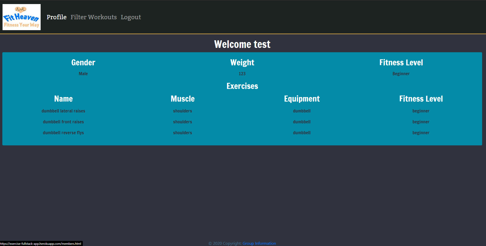

  # Fit Heaven



  

## Description 
 
  It's a gym app that, after you login/signup,you can create a profile and a workout with a simple questionnaire. Our questionnaire allows you to build a workout based on the equipment you have available, your fitness level and the muscle group(s) you want to work. 
  
https://exercise-fullstack-app.herokuapp.com/

## Table of Contents 
 
- [Installation](#Installation) 

- [Usage](#Usage) 

- [License](#License) 

- [Contributing](#Contributing) 

- [Tests](#Tests) 

- [Questions](#Questions) 


## Installation  

```
npm install
```

## Usage 


## License 

This project is licensed under MIT license.

## Contributing 

undefined

## Tests 

```
npm test
```

## Questions 


If you have any questions, please contact adriana-didden directly at adrianadidden@gmail.com. 


If you have any questions, please contact zachmdws directly at zachdmws@gmail.com. 


If you have any questions, please contact wwshehan directly at wwshehan@gmail.com. 


If you have any questions, please contact kevincwashburn directly at kevincwashburn@gmail.com. 
